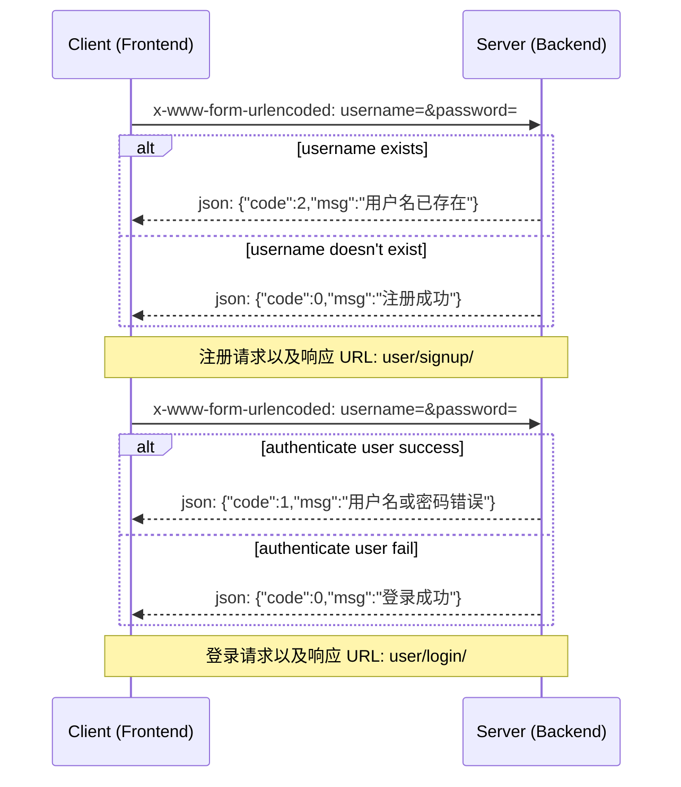
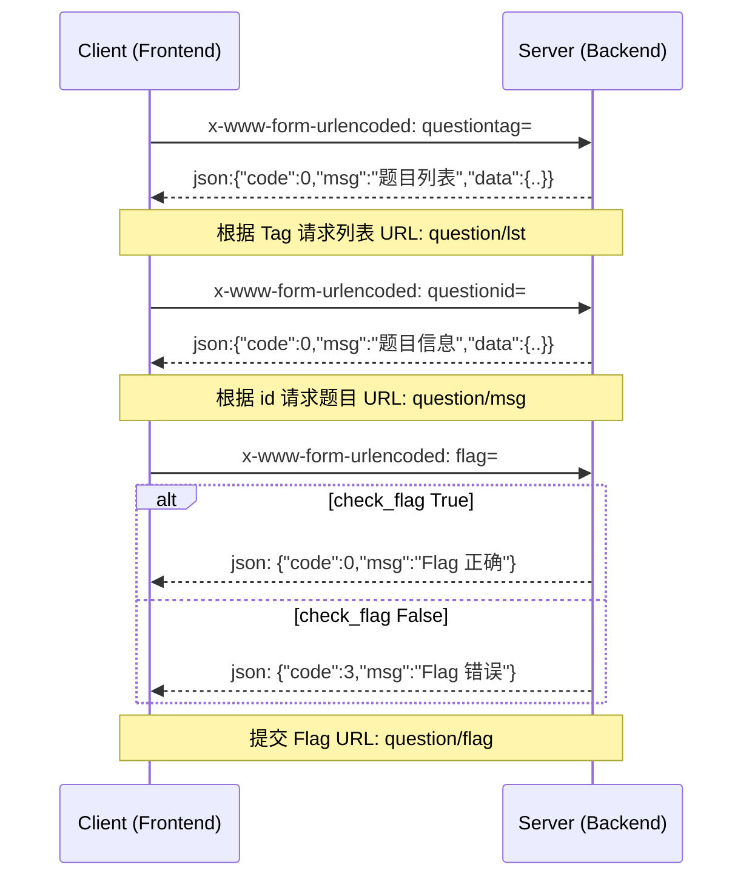
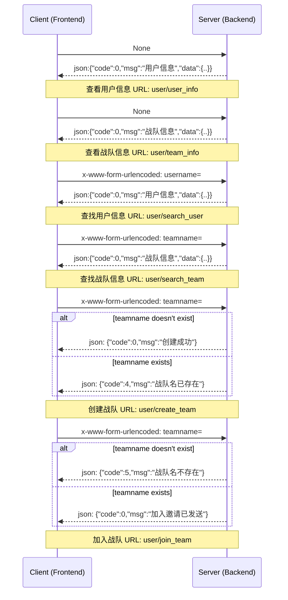
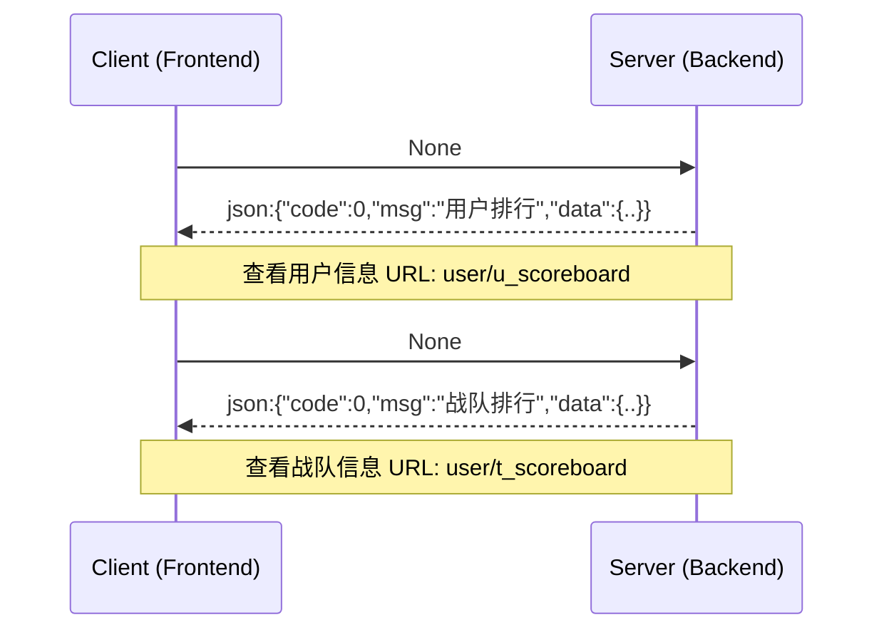

# API-DOCUMENT

## 登录注册界面

```mermaid
sequenceDiagram;

Client (Frontend) ->> Server (Backend):x-www-form-urlencoded: username=&password=
alt username exists
	Server (Backend) -->> Client (Frontend):json: {"code":2,"msg":"用户名已存在"}
else username doesn't exist
	Server (Backend) -->> Client (Frontend):json: {"code":0,"msg":"注册成功"}
end
Note over Client (Frontend),Server (Backend): 注册请求以及响应 URL: user/signup/

Client (Frontend) ->> Server (Backend):x-www-form-urlencoded: username=&password=
alt authenticate user success
	Server (Backend) -->> Client (Frontend):json: {"code":1,"msg":"用户名或密码错误"}
else authenticate user fail
	Server (Backend) -->> Client (Frontend):json: {"code":0,"msg":"登录成功"}
end
Note over Client (Frontend),Server (Backend): 登录请求以及响应 URL: user/login/

```

## 题目界面

```mermaid
sequenceDiagram;
Client (Frontend) ->> Server (Backend): x-www-form-urlencoded: questiontag=
Server (Backend) -->> Client (Frontend): json:{"code":0,"msg":"题目列表","data":{..}}
Note over Client (Frontend), Server (Backend): 根据 Tag 请求列表 URL: question/lst

Client (Frontend) ->> Server (Backend): x-www-form-urlencoded: questionid=
Server (Backend) -->> Client (Frontend): json:{"code":0,"msg":"题目信息","data":{..}}
Note over Client (Frontend), Server (Backend): 根据 id 请求题目 URL: question/msg

Client (Frontend) ->> Server (Backend): x-www-form-urlencoded: flag=
alt check_flag True
	Server (Backend) -->> Client (Frontend):json: {"code":0,"msg":"Flag 正确"}
else check_flag False
	Server (Backend) -->> Client (Frontend):json: {"code":3,"msg":"Flag 错误"}
end
Note over Client (Frontend), Server (Backend): 提交 Flag URL: question/flag
```

## 用户信息

```mermaid
sequenceDiagram
Client (Frontend) ->> Server (Backend): None
Server (Backend) -->> Client (Frontend): json:{"code":0,"msg":"用户信息","data":{..}}
Note over Client (Frontend), Server (Backend): 查看用户信息 URL: user/user_info

Client (Frontend) ->> Server (Backend): None
Server (Backend) -->> Client (Frontend): json:{"code":0,"msg":"战队信息","data":{..}}
Note over Client (Frontend), Server (Backend): 查看战队信息 URL: user/team_info

Client (Frontend) ->> Server (Backend): x-www-form-urlencoded: username=
Server (Backend) -->> Client (Frontend): json:{"code":0,"msg":"用户信息","data":{..}}
Note over Client (Frontend), Server (Backend): 查找用户信息 URL: user/search_user

Client (Frontend) ->> Server (Backend): x-www-form-urlencoded: teamname=
Server (Backend) -->> Client (Frontend): json:{"code":0,"msg":"战队信息","data":{..}}
Note over Client (Frontend), Server (Backend): 查找战队信息 URL: user/search_team

Client (Frontend) ->> Server (Backend): x-www-form-urlencoded: teamname=
alt teamname doesn't exist
	Server (Backend) -->> Client (Frontend):json: {"code":0,"msg":"创建成功"}
else teamname exists
	Server (Backend) -->> Client (Frontend):json: {"code":4,"msg":"战队名已存在"}
end
Note over Client (Frontend), Server (Backend): 创建战队 URL: user/create_team

Client (Frontend) ->> Server (Backend): x-www-form-urlencoded: teamname=
alt teamname doesn't exist
	Server (Backend) -->> Client (Frontend):json: {"code":5,"msg":"战队名不存在"}
else teamname exists
	Server (Backend) -->> Client (Frontend):json: {"code":0,"msg":"加入邀请已发送"}
end
Note over Client (Frontend), Server (Backend): 加入战队 URL: user/join_team
```

## 排行榜

```mermaid
sequenceDiagram
Client (Frontend) ->> Server (Backend): None
Server (Backend) -->> Client (Frontend): json:{"code":0,"msg":"用户排行","data":{..}}
Note over Client (Frontend), Server (Backend): 查看用户信息 URL: user/u_scoreboard

Client (Frontend) ->> Server (Backend): None
Server (Backend) -->> Client (Frontend): json:{"code":0,"msg":"战队排行","data":{..}}
Note over Client (Frontend), Server (Backend): 查看战队信息 URL: user/t_scoreboard
```

